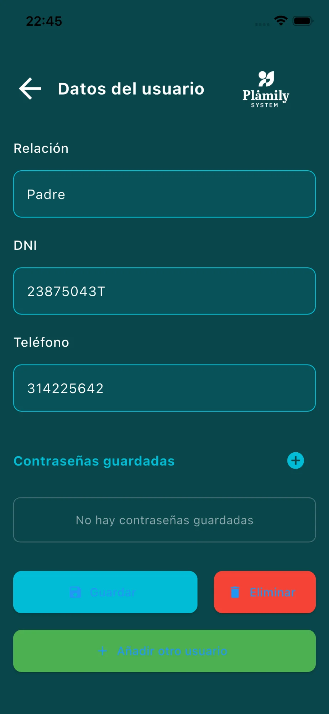
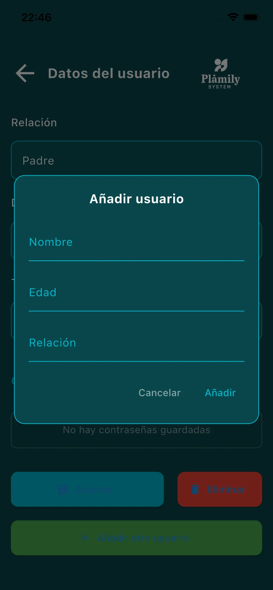

# Datos del Usuario

Gestiona la información de las personas mayores que cuidas.

## Campos disponibles

- **Nombre completo**: Nombre del mayor.
- **Edad**: Edad del mayor.
- **Relación**: Tu relación con esta persona (Padre, Madre, Abuelo, etc.).
- **DNI**: Documento de identidad.
- **Teléfono**: Número de contacto.

## Parte inferior de la pantalla

- **Contraseñas guardadas**: Almacena contraseñas importantes de forma segura.
- **Botón "Guardar"**: Guarda los cambios.
- **Botón "Eliminar"**: Elimina este usuario.
- **Botón "Añadir otro usuario"**: Crea un nuevo mayor para gestionar.

## Añadir Contraseña

Pulsa el "+" junto a "Contraseñas guardadas":

- **Descripción**: Para qué es la contraseña (ej: "Banco", "Email").
- **Email/Usuario** (opcional): Usuario asociado.
- **Contraseña**: La contraseña a guardar.

## Añadir Nuevo Usuario

Pulsa "Añadir otro usuario":

- **Nombre**: Nombre del mayor.
- **Edad**: Edad.
- **Relación**: Tu relación con esta persona.
