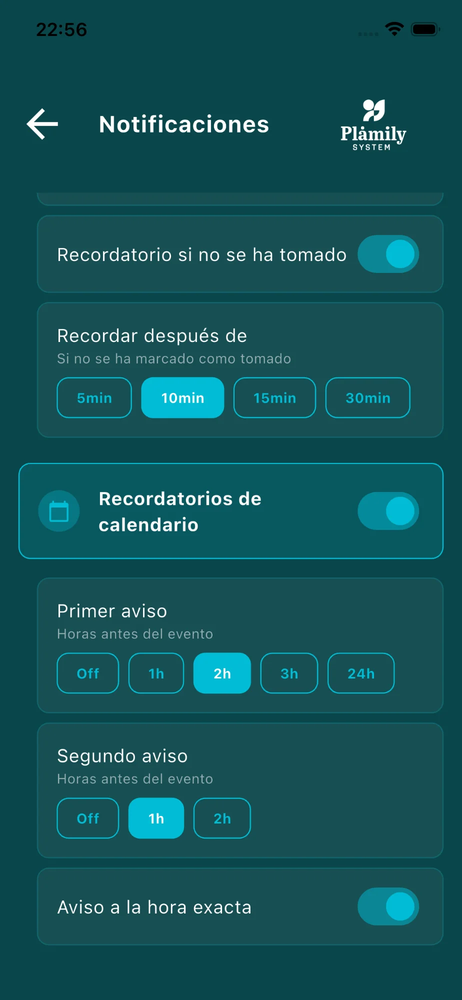

# Configuración de Notificaciones

Personaliza cuándo y cómo recibes las alertas.

## Recordatorios de medicamentos

- **Activar/Desactivar**: Activa o desactiva todos los recordatorios de medicamentos.
- **Aviso previo**: Recibe una alerta antes de la hora de toma (Off, 5min, 10min, 15min, 30min).
- **Aviso a la hora exacta**: Notificación en el momento exacto de la toma.
- **Recordatorio si no se ha tomado**: Alerta adicional si el medicamento no se marca como tomado.
- **Recordar después de**: Tiempo de espera para el recordatorio adicional (5min, 10min, 15min, 30min).

## Recordatorios de calendario

- **Activar/Desactivar**: Activa o desactiva las alertas de calendario.
- **Primer aviso**: Horas antes del evento (Off, 1h, 2h, 3h, 24h).
- **Segundo aviso**: Recordatorio adicional (Off, 1h, 2h).
- **Aviso a la hora exacta**: Notificación en el momento del evento.

## Notificaciones del hogar

Recibe alertas cuando otros miembros hacen cambios:

- **Cambios en medicamentos**: Cuando se añade o elimina un medicamento.
- **Medicamento tomado**: Cuando alguien marca un medicamento como tomado.
- **Cambios en mayores**: Cuando se añade o elimina un mayor.
- **Cambios en miembros**: Cuando alguien se une o sale del hogar.

> 💡 Los cambios se guardan automáticamente.
