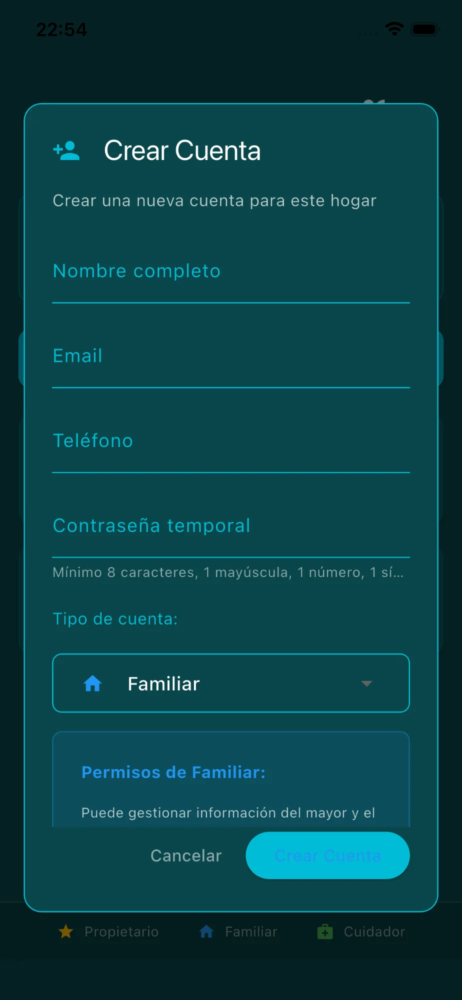
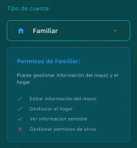
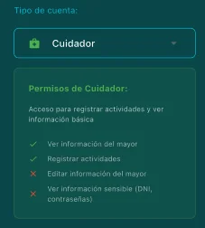

# Gestión de Permisos

Invita a familiares y cuidadores para que colaboren en el cuidado.

## Elementos de la pantalla

* **Información del hogar**: Nombre y número de miembros.
* **Botón "Crear Nueva Cuenta"**: Invita a un nuevo miembro.
* **Lista de miembros**: Muestra todos los usuarios con acceso.
* **Roles identificados por color**:
  * 🟡 **Propietario**: Control total.
  * 🔵 **Familiar**: Puede gestionar información.
  * 🟢 **Cuidador**: Acceso limitado.
* **Menú de tres puntos**: Opciones para cambiar rol o eliminar miembro.

## Crear Nueva Cuenta

* **Nombre completo**: Nombre del nuevo miembro.
* **Email**: Correo electrónico (recibirá invitación).
* **Teléfono**: Número de contacto.
* **Contraseña temporal**: Contraseña inicial que podrá cambiar al iniciar sesión.
* **Tipo de cuenta**: Familiar o Cuidador.

## Tipos de cuenta

### Familiar

* ✅ Editar información del mayor
* ✅ Gestionar el hogar
* ✅ Ver información sensible
* ❌ Gestionar permisos de otros

### Cuidador

* ✅ Ver información del mayor
* ✅ Registrar actividades
* ❌ Editar información del mayor
* ❌ Ver información sensible (DNI, contraseñas)
