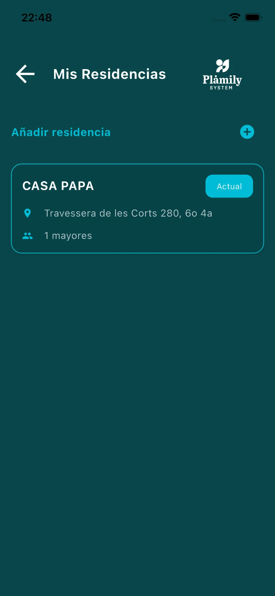
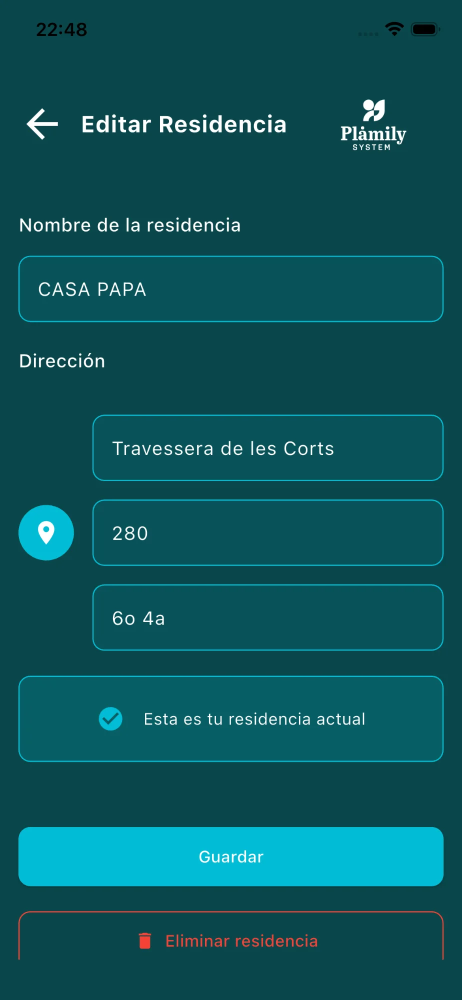

# Residencias

Gestiona los diferentes hogares donde viven los mayores que cuidas.

## Elementos de la pantalla

* **Botón "Añadir residencia"**: Crea un nuevo hogar.
* **Lista de residencias**: Muestra todas las residencias con nombre, dirección y número de mayores.
* **Etiqueta "Actual"**: Indica cuál es la residencia principal activa.

## Añadir Residencia

Pulsa el "+" para crear una nueva:

* **Nombre de la residencia**: Identificador del hogar (ej: "Casa Papá").
* **Dirección**:
  * Calle
  * Número
  * Piso y puerta
* **Botón "Crear Residencia"**: Confirma y crea el hogar.

## Editar Residencia

Pulsa sobre cualquier residencia para editarla:

* Modifica nombre y dirección.
* **Checkbox "Esta es tu residencia actual"**: Marca este hogar como el principal.
* **Botón "Guardar"**: Guarda los cambios.
* **Botón "Eliminar residencia"**: Borra el hogar permanentemente.
