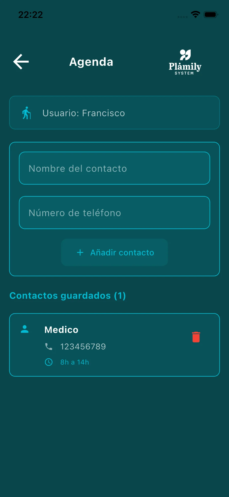

# Agenda

Guarda los contactos importantes relacionados con el cuidado del mayor: médicos, enfermeros, cuidadores, etc.

## Elementos de la pantalla

* **Selector de usuario**: Elige para qué mayor estás gestionando los contactos. Se convierte en desplegable si hay más de uno en el hogar.
* **Formulario de nuevo contacto**: Campos para nombre y número de teléfono.
* **Botón "Añadir contacto"**: Guarda el nuevo contacto.
* **Lista de contactos guardados**: Muestra todos los contactos con nombre, teléfono y disponibilidad.
* **Icono papelera**: Elimina el contacto.

## Editar Contacto

Pulsa sobre cualquier contacto para acceder a la edición completa:

* **Nombre**: Nombre del contacto.
* **Número de teléfono**: Teléfono principal.
* **Email**: Correo electrónico (opcional).
* **Disponibilidad**: Horario en el que se puede contactar.
* **Notas**: Información adicional como ubicación o indicaciones.
* **Botón Guardar**: Guarda los cambios realizados.
