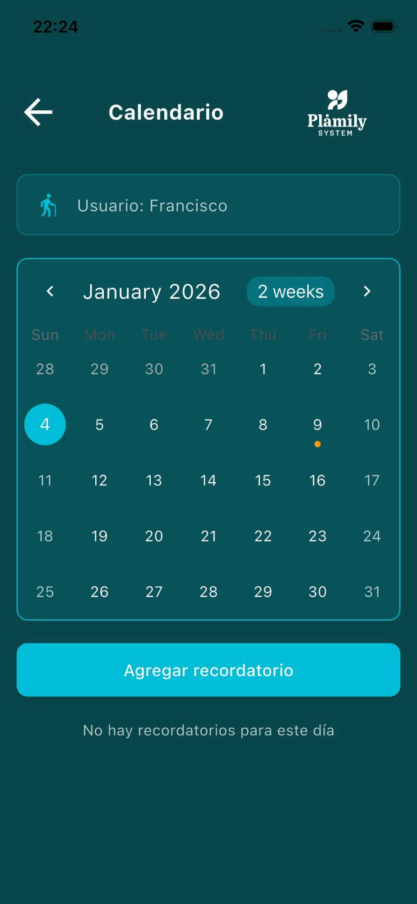

# Calendario

Organiza citas médicas, eventos y recordatorios importantes.

## Elementos de la pantalla

* **Selector de usuario**: Elige para qué mayor estás consultando el calendario.
* **Vista de calendario**: Muestra el mes actual con navegación entre meses.
* **Indicador de eventos**: Los días con un punto amarillo tienen recordatorios programados.
* **Botón "Agregar recordatorio"**: Crea un nuevo evento en el día seleccionado.
* **Lista de recordatorios**: Muestra los eventos del día seleccionado.

## Añadir Recordatorio

1. Selecciona el día en el calendario.
2. Pulsa "Agregar recordatorio".
3. Completa los campos:
   * **Título del recordatorio**: Nombre del evento.
   * **Descripción** (opcional): Detalles adicionales.
   * **Hora seleccionada**: Hora del evento.
4. Pulsa "Guardar" para confirmar.

## Selector de Hora

* Usa la rueda para seleccionar hora y minutos.
* También puedes pulsar el icono de teclado para escribir la hora manualmente.
* Pulsa "OK" para confirmar o "Cancel" para cancelar.
