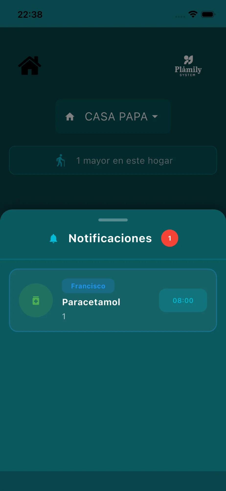

# Home

La pantalla principal de Plamily desde donde accedes a todas las funcionalidades.

## Elementos de la pantalla

* **Botón Dashboard** (esquina superior izquierda): Accede al panel de configuración y ajustes.
* **Selector de hogar**: Muestra el hogar actual. Se convierte en desplegable si tienes más de uno registrado.
* **Contador de usuarios**: Indica cuántos mayores están siendo gestionados en este hogar.
* **Botón Agenda**: Accede a la libreta de contactos.
* **Botón Medicamentos**: Gestiona los medicamentos programados.
* **Botón Calendario**: Consulta y añade recordatorios.
* **Botón Notificaciones**: Abre el panel de notificaciones.

## Panel de Notificaciones

Al pulsar el botón de notificaciones se despliega un panel con:

* Lista de medicamentos pendientes de tomar.
* Nombre del usuario y hora programada.
* Pulsa sobre una notificación para ir directamente a la pantalla de medicamentos.
