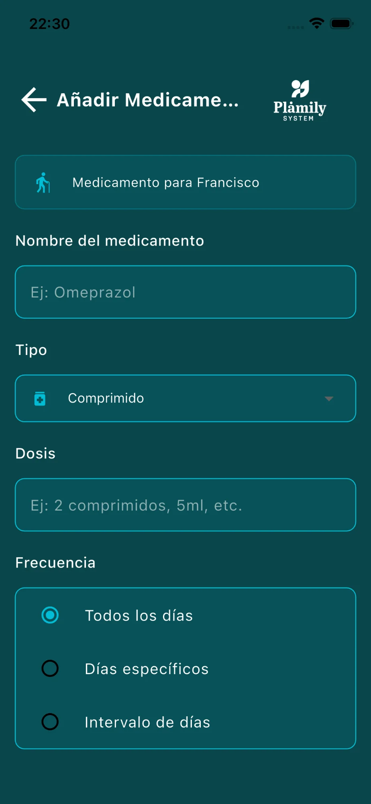
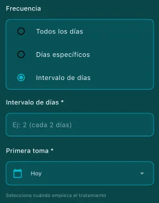
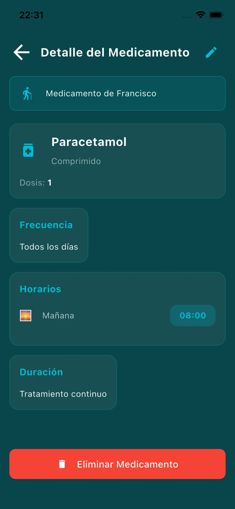

# Medicamentos

Gestiona todos los medicamentos y sus horarios de toma.

## Elementos de la pantalla

- **Selector de usuario**: Elige para qué mayor estás gestionando los medicamentos.
- **Carrusel de días**: Navega entre los días del mes. Siempre se posiciona en el día actual.
- **Botón "Ir a hoy"**: Vuelve rápidamente al día actual.
- **Lista de medicamentos**: Muestra los medicamentos programados para el día seleccionado.
- **Botón "Añadir medicamento"**: Crea un nuevo medicamento.

## Añadir Medicamento

### Paso 1: Información básica

- **Nombre del medicamento**: Escribe el nombre (ej: Omeprazol).
- **Tipo**: Selecciona el formato (Comprimido, Jarabe, Inyección, etc.).
- **Dosis**: Indica la cantidad (ej: 2 comprimidos, 5ml).
- **Frecuencia**: Elige cuándo se debe tomar.

### Opciones de frecuencia

**Todos los días**: El medicamento se toma diariamente.

**Días específicos**:

Selecciona los días de la semana que correspondan.

**Intervalo de días**:

Para medicamentos que se toman cada X días. Indica el intervalo y cuándo será la primera toma.

### Paso 2: Horarios y duración

- **Horarios**: Selecciona Mañana, Tarde o Noche y establece la hora exacta. Pulsa el "+" para añadir más horarios si el medicamento se toma varias veces al día.
- **Duración**:
  - **Continuo**: Tratamiento sin fecha de finalización.
  - **Por días específicos**: Indica cuántos días dura el tratamiento.
- **Notas** (opcional): Instrucciones adicionales como "Tomar con comida".
- **Botón "Guardar Medicamento"**: Confirma y crea el medicamento.

## Detalle del Medicamento

Accede pulsando el icono de información (i) en cualquier medicamento.

- Muestra toda la información del medicamento: nombre, tipo, dosis, frecuencia, horarios y duración.
- **Icono de lápiz** (esquina superior derecha): Edita el medicamento.
- **Botón "Eliminar Medicamento"**: Borra el medicamento permanentemente.
